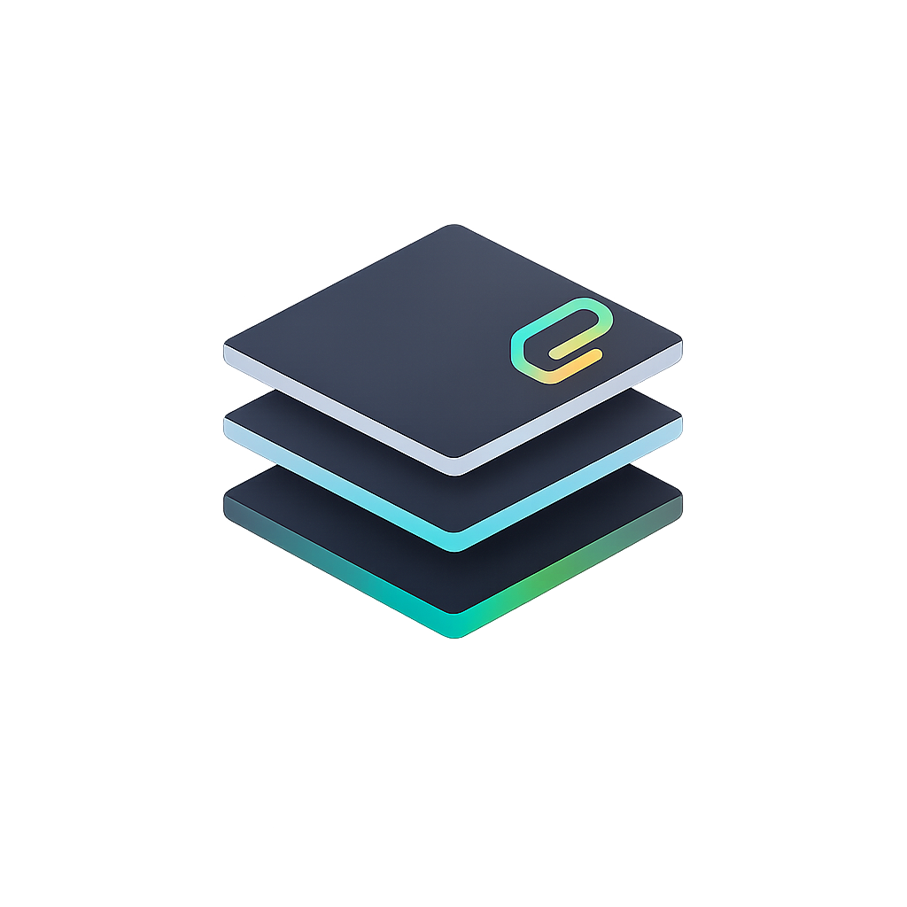

<p align="center">
  
</p>

<h1 align="center">ClipDeck</h1>
<p align="center">
  <strong>A lightweight clipboard manager for macOS</strong>
</p>
<p align="center">
  Copy once. Access anytime. Lives in your menu bar.
</p>

<p align="center">
  <a href="#features">Features</a> •
  <a href="#installation">Installation</a> •
  <a href="#usage">Usage</a> •
  <a href="#contributing">Contributing</a>
</p>

---

## Features

- **Automatic clipboard monitoring** — Copies are captured as you work
- **Pin favorites** — Keep important clips; they persist across restarts
- **Recent clips** — Up to 50 recent items, always at hand
- **Search** — Find clips instantly by text
- **Edit & organize** — Edit, pin, unpin, or delete any clip
- **One-click copy** — Click a clip to copy it back to the clipboard
- **Settings** — Optional trim of leading/trailing spaces when adding clips
- **Menu bar only** — No Dock icon; stays out of your way

---

## Installation

### Download

1. Go to the [Releases](https://github.com/YOUR_USERNAME/clipdeck/releases) page
2. Download `clipdeck.dmg`
3. Open the DMG and drag ClipDeck to Applications

### Build from source

```bash
git clone https://github.com/YOUR_USERNAME/clipdeck.git
cd clipdeck
open clipdeck.xcodeproj
```

Then in Xcode: **Product → Run** (⌘R)

**Requirements:** Xcode 15+, macOS 13+

---

## Usage

1. Click the ClipDeck icon in the menu bar
2. Copy text anywhere — it appears in ClipDeck automatically
3. Click a clip to copy it again
4. Use **Pin** to keep clips, **Edit** to change them, **Delete** to remove them
5. Use **Clear Unpinned** to remove all recent (non-pinned) clips

---

## Tech Stack

- **SwiftUI** — Modern declarative UI
- **Swift** — Native macOS app
- **Combine** — Reactive state management
- **UserDefaults** — Persistent storage for pinned clips

---

## Project Structure

```
clipdeck/
├── clipdeck/
│   ├── clipdeckApp.swift      # App entry, MenuBarExtra
│   ├── ContentView.swift     # Main UI, clip list
│   ├── ClipdeckStore.swift   # State, pasteboard, persistence
│   ├── SettingsView.swift    # Preferences
│   └── SettingsWindowController.swift
├── docs/
│   ├── CODEBASE.md           # Architecture overview
│   └── SWIFT_LEARNING.md      # Swift concepts (with examples)
└── clipdeck.xcodeproj
```

---

## Contributing

Contributions are welcome. Here’s how you can help:

### Reporting bugs

- Open an [issue](https://github.com/YOUR_USERNAME/clipdeck/issues)
- Describe the bug, steps to reproduce, and your macOS version
- Include screenshots if relevant

### Suggesting features

- Open an [issue](https://github.com/YOUR_USERNAME/clipdeck/issues) with the `enhancement` label
- Describe the feature and why it would be useful

### Submitting code

1. **Fork** the repository
2. **Create a branch** for your change:
   ```bash
   git checkout -b feature/your-feature-name
   # or
   git checkout -b fix/your-bug-fix
   ```
3. **Make your changes** — keep them focused and well-tested
4. **Commit** with clear messages:
   ```bash
   git commit -m "Add: keyboard shortcut for copying"
   ```
5. **Push** to your fork:
   ```bash
   git push origin feature/your-feature-name
   ```
6. **Open a Pull Request** against the `main` branch
   - Describe what changed and why
   - Reference any related issues

### Development setup

- Open `clipdeck.xcodeproj` in Xcode
- Select the **clipdeck** scheme
- Run with ⌘R
- Check `docs/CODEBASE.md` for architecture details

### Code style

- Follow existing Swift/SwiftUI patterns in the project
- Use `// MARK: -` for section headers
- Keep views small; extract helpers when needed

---
